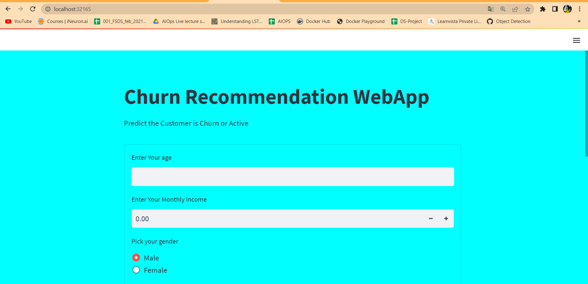

# ChurnModel

Build Simple Docker Image , To Use Follow 3 instruction Listed below

To Get the Docker Image 

```
docker pull karthiksaran11/churnmlproject
```

To Run the Docker Image

```
docker run --name mlproject -d -p 5000:8501 karthiksaran11/churnmlproject
```

To Check Browser

```
localhost:5000
```

To Add Kubernates create Deployment and Service .yaml file

```
cd "K8"

kubectl create -f churn-deployment.yaml

kubectl create -f churn-svc.yaml
```

Now file is added Check the status of the service

```
kubectl get svc
```

Now App is running on 32165 port , Test any Browser

```
http://localhost:32165/
```


